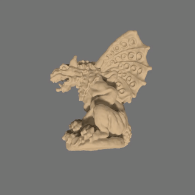

# PREF
<p align="left">

  <h3 align="left">
  <a href="https://arxiv.org/abs/2205.13524">
  PREF: Phasorial Embedding Fields for Compact Neural Representations
  </a>
  </h3>
   
  <p align="left">
    <a href="https://hbb1.github.io/">Binbin Huang</a>
    ·
    <a href="https://svip-lab.github.io/">Xinhao Yan</a>
    ·
    <a href="https://apchenstu.github.io/">Anpei Chen</a>
    ·
    <a href="https://scholar.google.co.jp/citations?hl=zh-CN&user=fe-1v0MAAAAJ">Shenghua Gao</a>
    ·
    <a href="http://www.yu-jingyi.com/">Jingyi Yu</a>

  </p>
  </h4>
  <div align="left"></div>
</p>


<table>
<tr>
<td align="center"></td>
<td align="center"></td>
<td align="center"></td>
</tr>
<tr>
    <td>novel view sythesis</td>
    <td>image regression </td>
    <td>neural field editing</td>
  </tr>
</table>


<a href="https://arxiv.org/abs/2205.13524">PREF</a>  is an efficient frequency-based neural scene representation that allows:
1. super fast training and rendering novel views. (fast and approximated solvers, *FFT*, exist.)
2. preserving high-order derivatives. (periodic nature of sinusoidal functions.)
3. editing optimized neural fields through frequency-domain manipulations. (convolutional kernels as Fourier multipliers.)

### TL;DR
<p>We learn frequency representations (<font color='blue'>blue</font>) for neural signals (<font color='red'>red</font>)</P>
<p align="center">
     
</p>


## Installation

Tested on Ubutu 20.04 + Pytorch 1.11.0 
(It seems important to install Pytorh version higher than 1.11.0 for complex tensor optimization).

## Using PREF
Replacing `tiny PE encoder + deep MLP` with `PREF encoder (dense PE) + shallow MLP` to accelerate neural signal reconstruction. This is a preliminary release, without being carefully tested.
### Example
```python
import torch
import torch.nn as nn
import torch.nn.functional as F
from encoder.pref_encoder import PREF

class NeuralField(nn.Module):
  def __init__(self):
    super().__init__()
    self.encoder = PREF(linear_freqs=[128]*3, reduced_freqs=[1]*3, feature_dim=16)
    
    input_dim = self.encoder.output_dim
    hidden_dim = 64
    self.mlp = torch.nn.Sequential(
      torch.nn.Linear(input_dim, hidden_dim), 
      torch.nn.ReLU(inplace=True), 
      torch.nn.Linear(hidden_dim, 1))

  def forward(self, x):
    x = self.encoder(x)
    x = self.mlp(x)
    return x
``` 

## NeRF with PREF 
The code is built upon [TensoRF](https://github.com/apchenstu/TensoRF), so you can also refer to it in case you have any issues.

### Installation
Install environment:
```
conda create -n PhasoRF python=3.8
conda activate PhasoRF
pip install torch torchvision
pip install tqdm scikit-image opencv-python configargparse lpips imageio-ffmpeg kornia lpips tensorboard
```

### Dataset
* [Synthetic-NeRF](https://drive.google.com/drive/folders/128yBriW1IG_3NJ5Rp7APSTZsJqdJdfc1) 
* [Synthetic-NSVF](https://dl.fbaipublicfiles.com/nsvf/dataset/Synthetic_NSVF.zip)
* [Tanks&Temples](https://dl.fbaipublicfiles.com/nsvf/dataset/TanksAndTemple.zip)
* [Forward-facing](https://drive.google.com/drive/folders/128yBriW1IG_3NJ5Rp7APSTZsJqdJdfc1)

### Quick Start
The training script is in train.py, to train a NeRF with PREF:
```
python train.py --config configs/hotdog.txt
```

You need to set `--render_test 1`/`--render_path 1` if you want to render testing views or path after training. 

More options refer to the `opt.py`. 


We provide a few examples in the configuration folder, note that:

`dataset_name`, choices = ['blender', 'llff', 'nsvf', 'tankstemple']. 

Notice: We have tested parameters for 'blender' dataset, and others stay tuning. 


## Acknowledgement
NeRF with PREF extensively uses code from [TensoRF](https://github.com/apchenstu/TensoRF). 


## Citation
If you find our code or paper helpful in your research, please cite
```bibtex
@article{Huang2022PREF,
  author = {Huang, Binbin and Yan, Xinhao and Chen, Anpei and Gao,Shenghua and Yu, Jingyi},
  title = {PREF: Phasorial Embedding Fields for Compact Neural Representations},
  publisher = {arXiv},
  year = {2022},
}
```